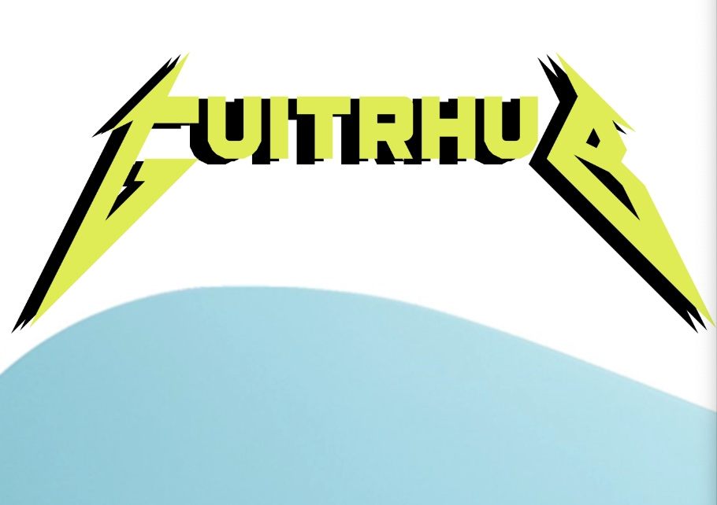

 
# What is GuitrHub?

Guitrhub is a dedicated platform designed for guitar enthusiasts to share and review their favorite guitars. Multiple users can collaborate in assessing and rating the same guitar, fostering a community of passionate guitarists.

# Inspiration

The inspiration for creating the Guitrhub app is rooted in a deep passion for music and guitars. As someone who has spent considerable time on platforms like sevenstring.org, Premiere Guitar, and others, reading reviews and contributing, the idea is to channel that enthusiasm into building a community where guitar enthusiasts can share their love for the instrument, exchange insights, and empower fellow guitarists in making informed choices. Additionally, the desire to leverage technology for an enhanced guitar-playing experience and personal growth plays a significant role in this endeavor. 

# Technologies Used

# Getting Started
Link to live build: https://guitrhub-91c3f0c4fac4.herokuapp.com/

1. Start by logging in with your Google Account
2. Navigate to "New Guitars" and add in your Brand and Model of guitar
3. Navigate to "All Guitars" and click "Reviews" to start adding your review
4. In "Add a Review" yoiu can enter your review thoughts and a rating. Hit "Add Review" to submit.
5. Users have the option to edit or delete their reviews after submitting

# Next Steps
- Adding in a feature that allows users to upload photos of their guitars
- Average rating for each guitardisplayed
- Update formatting so every page is uniform with styling
- Add functionality so that other users are able to comment on other reviews

